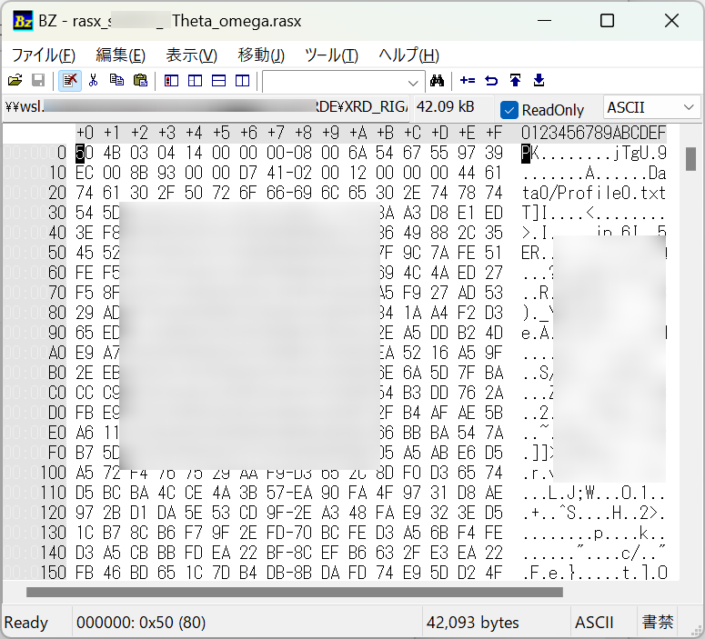

# XRDデータセットテンプレート

## 概要

XRD(X線回折)をご利用の方に適したテンプレートです。Rigaku社のrasまたはrasxまたはTXTフォーマット、またはBruker社のuxdフォーマットでデータを取得されている方がご利用いただけます。<br>
XRDの専門家によって監修されたメタ情報をデータファイルから自動的にRDEが抽出します。 プロットはリニアスケールとログスケールを出力します。

## カタログ番号

本テンプレートには、装置メーカーの違いによって以下のバリエーションが提供されています。
- DT0005
    - Rigaku 社製
- DT0009
    - Bruker 社製

## 登録できるデータ

本データセットテンプレートで作成したデータセットには、'データファイル'と'構造化ファイル'と'メタ情報'を登録することができます。なお、データファイルは１つ登録する必要があります。

### 登録ファイル

以下は本データセットテンプレートに登録可能なファイルの一覧です。

| 種類 | 命名規則 | 説明 |
| :---- | :---- | :---- |
| ras, rasx, TXT, uxdフォーマット| ※以下の'拡張子以外の命名規則について'参照 | XRD(もしくは付属ソフトウェア)が出力するデータファイル |

- 登録ファイルの中身 (以下、例)
  - xrd_sto001.ras (テキストデータ)  
    
  - ULVAC_O20230419-1_XRD_20230516.rasx (バイナリデータ)  
    
  - XRD.TXT (テキストデータ)  
    　　
  - XRD.uxd (テキストデータ)  
    　　
- 拡張子以外の命名規則について (ただし、TXT, uxdフォーマットは対象外)
  - ベース名は`_`で区切られた2つ以上のセクションで構成され、セクション2は試料名(ローカルID)メタにマッピングされる  
  - ベース名の左から3つ目以降の`_`は区切り文字として扱わない  
  - ファイル名 (以下、例)  
    - xrd_sto001.ras
      - 送り状画面のが試料名(ローカルID)の初期値が`sto001`となる
    - ULVAC_O20230419-1_XRD_20230516.rasx
      - 送り状画面のが試料名(ローカルID)の初期値が`O20230419-1`となる

    |ファイル名|文字列 セクション１|文字列 セクション2|文字列 セクション3|拡張子|
    |:----|:----|:----|:----|:----|
    |マッピング|***|sample_name\_(local_id)|***|***|
    |要否|必須|必須|任意|必須|
    |データ型|文字列|文字列|文字列|固定(.ras/.rasx)|
    |例）xrd_sto001.ras|xrd|sto001|***|ras|
    |例）rasx_sto001_2Theta_omega.rasx|rasx|sto001|2Theta_omega|rasx|

### 構造化ファイル

構造化ファイルは、データファイルを読み込んで構造化処理を行ったファイルです。構造化ファイルやグラフ画像ファイルなどが該当します。

| ファイル名 | 内容 |備考|
|:----|:----|:----|
|metadata.json|主要パラメータメタ情報ファイル||
|\*.csv|プロット画像元データ||
|\*.png|プロット画像<br>（Linear Scale）|<br>(タイトルはファイル名を設定。ラベルは変更可。)|
|\*_log.png|プロット画像<br>（Log Scale）|<br>(タイトルはファイル名を設定。ラベルは変更可。)|
|\*.html|html形式の代表画像<br>（LinearまたはLog Scaleプロット）||
|Profile0.txt|入力ファイルから抽出した測定データ<br>（入力ファイルが*.rasxの場合のみ）||
|MesurementConditions0.xml|入力ファイルから抽出したメタ情報<br>（入力ファイルが*.rasxの場合のみ）||

### メタ情報

次のように、大きく４つに分類されます。

- 基本情報
- 固有情報
- 試料情報
- 抽出メタ情報

#### 基本情報

基本情報はすべてのデータセットテンプレート共通のメタです。詳細は[データセット閲覧 RDE Dataset Viewer > マニュアル](https://dice.nims.go.jp/services/RDE/RDE_manual.pdf)を参照してください。

#### 固有情報

固有情報はデータセットテンプレート特有のメタです。以下は本データセットテンプレートに設定されている固有メタ情報項目です。

|項目名|必須|日本語語彙|英語語彙|単位|初期値|データ型|フォーマット|備考|
|:----|:----|:----|:----|:----|:----|:----|:----|:----|
|measurement_temperature||測定温度|Measurement Temperature|C||number|||
|sample_holder_name||試料ホルダー名|Sample Holder Name|||string|||
|key1||キー1|key1|||string||汎用項目|
|key2||キー2|key2|||string||汎用項目|
|key3||キー3|key3|||string||汎用項目|
|key4||キー4|key4|||string||汎用項目|
|key5||キー5|key5|||string||汎用項目|
|common_data_type||登録データタイプ|Data type||XRD|string|||
|common_data_origin||データの起源|Data Origin||experiments|string|||
|common_technical_category||技術カテゴリー|Technical Category||measurement|string|||
|common_reference||参考文献|Reference|||string|||
|measurement_method_category||計測法カテゴリー|Method category||散乱_回折|string|||
|measurement_method_sub_category||計測法サブカテゴリー|Method sub-category||X線回折|string|||
|measurement_analysis_field||分析分野|Analysis field|||string|||
|measurement_measurement_environment||測定環境|Measurement environment|||string|||
|measurement_energy_level_transition_structure_etc_of_interst||対象準位_遷移_構造|Energy level_transition_structure etc. of interst|||string|||
|measurement_measured_date||分析年月日|Measured date|||string||データファイルから自動取得 <table><thead><tr><th>フォーマット</th><th>メタデータ項目</th></tr></thead><tbody><tr><td>.ras</td><td>MEAS_SCAN_START_TIME</td></tr><tr><td>.rasx</td><td>rasx.scan_starting_date_time</td></tr><tr><td>.TXT</td><td>StartTime</td></tr><tr><td>.uxd</td><td>;content of</td></tr></tbody></table>|
|measurement_standardized_procedure||標準手順|Standardized procedure|||string|||
|measurement_instrumentation_site||装置設置場所|Instrumentation site|||string|||

#### 試料情報

試料情報は試料に関するメタで、試料マスタ（[データセット閲覧 RDE Dataset Viewer > マニュアル](https://dice.nims.go.jp/services/RDE/RDE_manual.pdf)参照）と連携しています。以下は本データセットテンプレートに設定されている試料メタ情報項目です。

|項目名|必須|日本語語彙|英語語彙|単位|初期値|データ型|フォーマット|備考|
|:----|:----|:----|:----|:----|:----|:----|:----|:----|
|sample_name_(local_id)|x|試料名(ローカルID)|Sample name (Local ID)|||string||データファイル名のセクション2から自動反映(.ras,.rasxのみ)|
|chemical_formula_etc.||化学式・組成式・分子式など|Chemical formula etc.|||string|||
|administrator_(affiliation)|x|試料管理者(所属)|Administrator (Affiliation)|||string|||
|reference_url||参考URL|Reference URL|||string|||
|related_samples||関連試料|Related samples|||string|||
|tags||タグ|Tags|||string|||
|description||試料の説明|Description |||string|||
|sample.general.general_name||一般名称|General name|||string|||
|sample.general.cas_number||CAS番号|CAS Number|||string|||
|sample.general.crystal_structure||結晶構造|Crystal structure|||string|||
|sample.general.sample_shape||試料形状|Sample shape|||string|||
|sample.general.purchase_date||試料購入日|Purchase date|||string|||
|sample.general.supplier||購入元|Supplier|||string|||
|sample.general.lot_number_or_product_number_etc||ロット番号、製造番号など|Lot number or product number etc|||string|||

#### 抽出メタ

抽出メタ情報は、データファイルから構造化処理で抽出したメタデータです。以下は本データセットテンプレートに設定されている抽出メタ情報項目です。
(項目名の*にはデータファイルの拡張子が入ります。)

|項目名|日本語語彙|英語語彙|単位|データ型|抽出元（.ras）|抽出元（.rasx）|抽出元（.TXT）|抽出元（.uxd）|備考|
|:----|:----|:----|:----|:----|:----|:----|:----|:----|:----|
|*.comment|コメント|Comment||string|FILE_COMMENT|Comment|Comments|;content of||
|*.memo|メモ|Memo||string|FILE_MEMO|Memo|-|-||
|*.measurement_operator|測定実施者|Measurement Operator||string|FILE_OPERATOR|Operator|-|-||
|*.specimen|試料|Specimen||string|FILE_SAMPLE|SampleName|Sample||
|*.detector_pixel_size|検出器ピクセルサイズ|Detector Pixel Size|mm|number|HW_COUNTER_PIXEL_SIZE|PixelSize|-|-||
|*.selected_detector_name|使用検出器名称|Selected Detector Name||string|HW_COUNTER_SELECT_NAME|Detector|Goniometer|; Goniometer||
|*.x-ray_target_material|X線ターゲットの材質|X-ray Target Material||string|HW_XG_TARGET_NAME|TargetName|-|_ANODE||
|*.k_alpha_1_wavelength|K_alpha1の波長|K_alpha_1 Wavelength|Angstrom|number|HW_XG_WAVE_LENGTH_ALPHA1|WavelengthKalpha1|-|_WL1||
|*.k_alpha_2_wavelength|K_alpha2の波長|K_alpha_2 Wavelength|Angstrom|number|HW_XG_WAVE_LENGTH_ALPHA2|WavelengthKalpha2|-|_WL2||
|*.ratio_k_alpha_2/k_alpha_1|K_alpha2/K_alpha1の比率|Ratio K_Alpha_2/K_Alpha_1|-|number|-|-|-|_WLRATIO||
|*.k_beta_wavelength|K_betaの波長|K_beta Wavelength|Angstrom|number|HW_XG_WAVE_LENGTH_BETA|WavelengthKbeta|-|-||
|*.optics_attribute|光学系属性|Optics Attribute||string|MEAS_COND_OPT_ATTR|Attribute|-|-||
|*.x-ray_tube_current|X線管電流|X-ray Tube Current|mA|number|MEAS_COND_XG_CURRENT|Current|X-Ray|_MA||
|*.x-ray_tube_voltage|X線管電圧|X-ray Tube Voltage|kV|number|MEAS_COND_XG_VOLTAGE|Voltage|X-Ray|_KV||
|*.wavelength_type|波長タイプ|Wavelength Type||string|MEAS_COND_XG_WAVE_TYPE|Wavelength Type|-|-||
|*.data_point_number|データ点数|Data Point Number||number|MEAS_DATA_COUNT|Data Point Number|-|-||
|*.scan_axis|スキャン軸|Scan Axis||string|MEAS_SCAN_AXIS_X|AxisName|ScanningMode|-||
|*.scan_starting_date_time|スキャン開始時刻|Scan Starting Date Time||string|MEAS_SCAN_START_TIME|StartTime|StartTime|-||
|*.scan_ending_date_time|スキャン終了時刻|Scan Ending Date Time||string|MEAS_SCAN_END_TIME|EndTime|StopTime|-||
|*.scan_mode|スキャンモード|Scan Mode||string|MEAS_SCAN_MODE|Mode|ScanningType|_STEPMODE||
|*.scan_speed|スキャンスピード|Scan Speed|deg/min|number|MEAS_SCAN_SPEED|Speed|Speed|-||
|*.scan_step_size|スキャンステップサイズ|Scan Step Size|deg|number|MEAS_SCAN_STEP|Step|Step|_STEPSIZE||
|*.scan_starting_position|スキャン開始位置|Scan Starting Position|deg|number|MEAS_SCAN_START|Start|Start|_START||
|*.scan_ending_position|スキャン終了位置|Scan Ending Position|deg|number|MEAS_SCAN_STOP|Stop|Stop|-||
|*.scan_axis_unit|スキャン軸の単位|Scan Axis Unit||string|MEAS_SCAN_UNIT_X|PositionUnit|-|-||
|*.intensity_unit|強度の単位|Intensity Unit||string|MEAS_SCAN_UNIT_Y|IntensityUnit|-|-||
|*.attachment|付属試料台|Attachment||string|-|-|Attachment|-||
|*.monochromator|分光器|Monochromator||string|-|-|Monochromater|; Incident beam monochromator||
|*.incidentbeampath_divergence_slit_width（angle)|入射光_発散スリット幅（角度）|Incident Beam Path Divergence Slit Width（angle)|deg|number|-|-|DS|-||
|*.diffractedbeampath_anti-scatter_slit_width|出射光_散乱スリット幅|Diffracted Beam Path Anti-Scatter Slit Width|mm|number|-|-|SS|-||
|*.diffractedbeampath_receiving_slit_width|出射光_受光スリット幅|Diffracted Beam Path Receiving Slit Width|mm|number|-|-|RS|-||
|*.aperture_width_of_1d_position_sensitive_detector(deg)|1次元検出器 開口幅（度）|Aperture width of 1D Position Sensitive Detector(deg)|deg|number|-|-|-|_V4_PSDAPERTURE||

## データカタログ項目

データカタログの項目です。データカタログはデータセット管理者がデータセットの内容を第三者に説明するためのスペースです。

|RDE用パラメータ名|日本語語彙|英語語彙|データ型|備考|
|:----|:----|:----|:----|:----|
|dataset_title|データセット名|Dataset Title|string||
|abstract|概要|Abstract|string||
|data_creator|作成者|Data Creator|string||
|language|言語|Language|string||
|experimental_apparatus|使用装置|Experimental Apparatus|string||
|data_distribution|データの再配布|Data Distribution|string||
|raw_data_type|データの種類|Raw Data Type|string||
|stored_data|格納データ|Stored Data|string||
|remarks|備考|Remarks|string||
|references|参考論文|References|string||
|key1|キー1|key1|string|送り状メタkey1の説明|
|key2|キー2|key2|string|送り状メタkey2の説明|
|key3|キー3|key3|string|送り状メタkey3の説明|
|key4|キー4|key4|string|送り状メタkey4の説明|
|key5|キー5|key5|string|送り状メタkey5の説明|

## 構造化処理の詳細

### 設定ファイルの説明

構造化処理を行う際の、設定ファイル(`rdeconfig.yaml`)の項目についての説明です。

| 階層 | 項目名 | 語彙 | データ型 | 標準設定値 | 備考 |
|:----|:----|:----|:----|:----|:----|
| system | extended_mode | 動作モード | string | (なし) | データファイル一括投入時'MultiDataTile'を設定 |
| system | magic_variable | マジックネーム | string | 'true' | ファイル名 = データ名としない場合は'false'に設定 |
| system | save_thumbnail_image | サムネイル画像保存  | string | 'true' | |
| - | filename_mapping_rule | ファイル名マッピング規則  | string |'true'| ファイル名からメタデータの一部を取得しない場合'false'に設定 |
| - | manufacturer | 装置メーカー名 | string | 'rigaku' or 'bruker' | |
| - | main_image_setting | 代表画像のグラフスケール | string | (なし) | メイングラフ画像を対数目盛(Logarithmic Scale)に設定する場合'log'を設定 |
| - | meas_scan_axis_x | x軸ラベル(名称)   | string | (なし) | 空白の場合、メタデータの'スキャン軸'の値を設定 <table><thead><tr><th>フォーマット</th><th>メタデータ項目</th></tr></thead><tbody><tr><td>.ras</td><td>MEAS_SCAN_AXIS_X</td></tr><tr><td>.rasx</td><td>AxisName</td></tr><tr><td>.TXT</td><td>ScanningMode</td></tr><tr><td>.uxd</td><td>プロット画像元データ(*.csv)のヘッダー</td></tr></tbody></table>|
| - | meas_scan_unit_x | x軸ラベル(単位) | string | (なし) | 空白の場合、メタデータの'スキャン軸の単位'の値を設定 <table><thead><tr><th>フォーマット</th><th>メタデータ項目</th></tr></thead><tbody><tr><td>.ras</td><td>MEAS_SCAN_UNIT_X</td></tr><tr><td>.rasx</td><td>PositionUnit</td></tr><tr><td>.TXT</td><td>(なし)</td></tr><tr><td>.uxd</td><td>(なし)</td></tr></tbody></table>|
| - | meas_scan_axis_y | y軸ラベル(名称)   | string | (なし) | 空白の場合、'Intensity'を設定 |
| - | meas_scan_unit_y | y軸ラベル(単位) | string | (なし) | 空白の場合、メタデータの'強度の単位'の値を設定 <table><thead><tr><th>フォーマット</th><th>メタデータ項目</th></tr></thead><tbody><tr><td>.ras</td><td>MEAS_SCAN_UNIT_Y</td></tr><tr><td>.rasx</td><td>IntensityUnit</td></tr><tr><td>.TXT</td><td>(なし)</td></tr><tr><td>.uxd</td><td>(なし)</td></tr></tbody></table>|

### dataset関数の説明

XRDが出力するデータを使用した構造化処理を行います。以下関数内で行っている処理の説明です。

```python
def dataset(srcpaths: RdeInputDirPaths, resource_paths: RdeOutputResourcePath) -> None:
    """Execute structured processing in XRD

    Execute structured text processing, metadata extraction, and visualization.
    It handles structured text processing, metadata extraction, and graphing.
    Other processing required for structuring may be implemented as needed.

    Args:
        srcpaths (RdeInputDirPaths): Paths to input resources for processing.
        resource_paths (RdeOutputResourcePath): Paths to output resources for saving results.

    Returns:
        None

    Note:
        The actual function names and processing details may vary depending on the project.
    """
```

### 設定ファイル、メタデータ初期値、使用クラスの取得

- 設定ファイルの設定項目については、[こちら](#設定ファイルの説明) を参照
```python
    # Get the class to use
    config, metadata_def, module = XrdFactory.get_objects(resource_paths.rawfiles[0], srcpaths.tasksupport)
```

### 計測ファイル(ras/rasx/TXT/uxdファイル)読み込み

- ファイルから計測データとメタデータを抽出する。
- リージョン数を取得する。
- 共通メタと繰り返しメタを抽出する。(シングルリージョンの場合も繰り返しメタとして扱われる。)
```python
    compressd_files: List[str] = []
    # Read Input File -> Save Meta -> Struct
    for data, meta in module.file_reader.read(resource_paths.rawfiles[0]):
        compressd_files = []
        region_num = module.file_reader.get_region_number()

        # Get meta
        const_meta, repeat_meta = module.meta_parser.parse(meta)
```

### 計測ファイルの構造化データ保存

- 計測ファイルのデータ部をcsvファイルとして保存する。
- マルチリージョンの場合、rasファイル名に接尾辞としてリージョン番号（_1または_2）を付加したファイル名で計測データをcsvとして保存する。
- rasxファイルはzipの展開処理を行い、アーカイブされていた各種ファイルを保存する。
```python
        # Save csv
        # Execute save process for structured files, only when a .rasx file is input,
        # as there are other files(xml, txt) compressed.
        if resource_paths.rawfiles[0].suffix == ".rasx":
            compressd_files = module.file_reader.get_files_from_rasx(resource_paths.rawfiles[0])
        module.structured_processer.save_csv(resource_paths, data, compressd_files, region_num=region_num)
```

### 計測ファイルの構造化データグラフ化

- ２種類のグラフスケール（リニアスケール、対数スケール）それぞれのグラフを作成する。
- グラフスケールの種類とリージョン数によって、グラフタイトル、グラフスケール、保存先が変わる。
```python
        # Plot
        module.graph_plotter.plot_main(data, resource_paths, region_num)
```

### 送り状（invoice.json）の分析年月日を上書き

- 送り状（invoice.json）の分析年月日に何も記入しなかった場合、ras/rasx/TXT/uxdファイルのヘッダーから分析年月日を取得し設定する。
```python
        # Overwrite invoice if needed
        # (sample/sampleId,names, custom/measurement_measured_date)
        invoice_org_obj = module.meta_parser.overwrite_invoice_if_needed(
            resource_paths,
            const_meta,
            repeat_meta,
            srcpaths.tasksupport.joinpath("filename_mapping_rule.txt")
        )
```

### メタデータを保存

- コンフィグファイルの項目:`main_image_setting`の値をリージョン数、メタデータの`main_image_setting`に設定する。
- メタデータを`metadata.json`として保存する。
```python
    # Save Meta
    # Add the graph scale meta
    # Read metadata about graph scale from rdeconfig.yaml and add it to the repeating metadata list.
    if config['main_image_setting']:
        config['main_image_setting'] = [config['main_image_setting'] for _ in range(region_num)]
        module.meta_parser.repeated_meta_info.update(config)
    module.meta_parser.save_meta(resource_paths.meta.joinpath("metadata.json"), Meta(metadata_def))
```

### マルチリージョンの構造化データグラフ化

- マルチリージョンの場合、各計測データを重ねたグラフを作成する。
```python
    # Plot
    # Integrated graph image if needed
    if region_num == 2:
        module.graph_plotter.multiplot_main(resource_paths)
```

### 送り状（invoice.json）の試料情報を上書き

- コンフィグファイルの項目:`filename_mapping_rule`が`True`の場合、ras/rasxファイル名から試料IDと試料名を抽出し、送り状`invoice.json`の同項目に設定する。
```python
    # Overwrite invoice
    # (sample/sampleId, names)
    module.invoice_writer.overwrite_invoice_sample_name(resource_paths)
```
